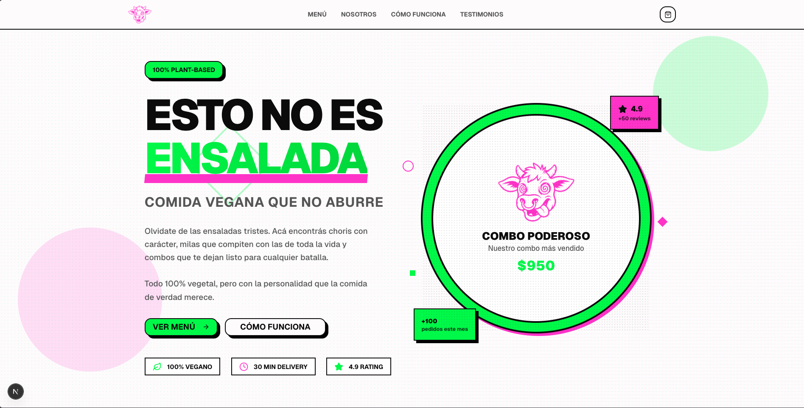

# 🌿 Esto No Es Ensalada

**Esto No Es Ensalada** es una plataforma de e-commerce gastronómico diseñada para un emprendimiento de comida plant-based con personalidad. El proyecto se enfoca en una experiencia de usuario fluida, un diseño vibrante y un sistema de pedidos directo vía WhatsApp.



## 🚀 Características Principales

- **Diseño Premium**: Estética moderna con sombras tipo comic (neo-brutalismo), micro-animaciones y una paleta de colores vibrante.
- **Menú Dinámico e Inteligente**:
  - Filtrado por categorías (Principales, Combos, Pizzas, Panes, Extras).
  - Buscador de platos en tiempo real.
  - Fuente de datos única para mantener precios y stock sincronizados.
- **Flujo de Pedido Simplificado**: Proceso de compra optimizado: **Carrito → Checkout (solo datos clave) → WhatsApp**.
- **Integración con WhatsApp**: 
  - Redirección automática del cliente al chat del comercio con el detalle de su pedido pre-formateado.
  - Notificaciones en segundo plano para el administrador (CallMeBot).
  - Generación de número de pedido único.
- **SEO & Performance**: Optimizado para motores de búsqueda con metadatos dinámicos y carga ultrarrápida.

## 🛠️ Stack Tecnológico

- **Framework**: [Next.js 16](https://nextjs.org/) (App Router)
- **Lenguaje**: TypeScript
- **Estilos**: Tailwind CSS 4 & Vanilla CSS
- **Componentes UI**: Radix UI & Shadcn/UI
- **Iconos**: Lucide React
- **Estado**: Context API (Cart Context) & Hooks personalizados

## 📦 Instalación y Uso

1. **Clonar el repositorio**:
   ```bash
   git clone [URL-DEL-REPO]
   ```

2. **Instalar dependencias**:
   ```bash
   npm install
   # o
   yarn install
   ```

3. **Configurar variables de entorno**:
   Crea un archivo `.env.local` con las siguientes claves:
   ```env
   NEXT_PUBLIC_CALLMEBOT_API_KEY=tu_api_key
   NEXT_PUBLIC_MERCHANT_PHONE=tu_telefono
   ```

4. **Correr en desarrollo**:
   ```bash
   npm run dev
   ```

## 🎨 Personalidad de Marca

> *"Comida vegana que rompe estereotipos. Porque comer rico también puede ser a base de plantas. Acá no hay lechuga triste, solo sabor real."*

---
Desarrollado con ❤️ para **Esto No Es Ensalada**.
